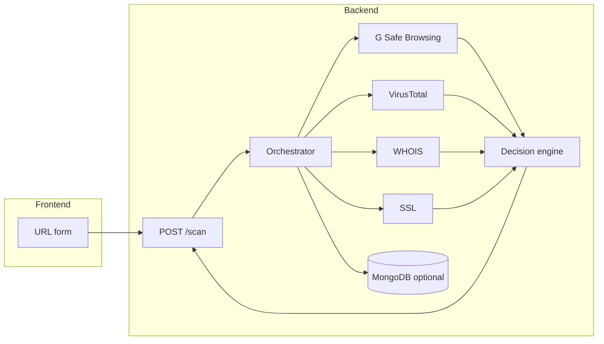

# Suspicious Link Checker

Open-source **URL risk analysis** tool. You submit a link; the backend runs checks in parallel (Google Safe Browsing, VirusTotal, WHOIS heuristics, TLS inspection), **normalizes** the results, and a **decision engine** produces an explainable **verdict** (`safe`, `suspicious`, or `malicious`) with scores, reasoning, and a timeline. A **React** UI shows the outcome clearly.

---

## What this project does

1. **Validates and canonicalizes** the URL (scheme, length, SSRF-related rules like private networks—configurable).
2. **Runs provider checks concurrently** (async HTTP and lookups).
3. **Merges signals** into a weighted risk score with confidence and human-readable **reasons**.
4. Optionally **persists scans** in **MongoDB** for later retrieval by ID.

Without API keys, Google Safe Browsing and VirusTotal still run but return `unknown` status for those sources; WHOIS and SSL checks can still contribute to the verdict.

---

## Repository layout

| Path | Role |
|------|------|
| `backend/` | FastAPI app (`app.main:app`), Motor/MongoDB, orchestrator, decision engine |
| `frontend/` | Vite + React SPA; calls the REST API |
| `VERCEL.md` | Notes for deploying the **frontend** to Vercel (API hosted separately) |

---

## How it works (high level)



- **Orchestrator** (`app/services/orchestrator.py`) runs four tasks via `asyncio.gather`, builds a **timeline** of events, then the **decision engine** (`app/decision_engine/scoring.py`) applies weights and rules (including overrides when Google Safe Browsing or VirusTotal report malicious).
- **API prefix** is `/api/v1` by default; scan routes live under `/api/v1/scan`.

---

## Prerequisites

Install these on your machine before cloning:

| Requirement | Notes |
|-------------|--------|
| **Git** | To clone the repository |
| **Python 3.10+** | Backend (3.11+ or 3.12 recommended) |
| **Node.js 18+** | Frontend (includes `npm`) |
| **MongoDB** | Local or remote; the API **connects at startup** and creates indexes |
| **API keys (optional)** | [Google Safe Browsing API](https://developers.google.com/safe-browsing), [VirusTotal API](https://developers.virustotal.com/) — improves coverage |

`WHOIS_API_KEY` appears in `.env.example` for possible future use; **WHOIS** currently uses the `python-whois` library and does not require that key.

---

## Clone the repository

**Windows (PowerShell)** or **macOS / Linux (bash)**:

```bash
git clone <YOUR_REPO_URL>
cd link_checker
```

Use the real URL of this repo (for example `https://github.com/your-org/link_checker.git`).

---

## MongoDB

The backend expects MongoDB to be **reachable** before you start the API (default: `mongodb://localhost:27017`).

### Option A — MongoDB already installed locally

Start the `mongod` service the way your OS documents (Windows Service, `brew services`, `systemd`, Docker, etc.).

### Option B — Docker (if you use Docker)

```bash
docker run -d --name link-checker-mongo -p 27017:27017 mongo:7
```

Then keep `MONGODB_URI=mongodb://localhost:27017` in `backend/.env` unless you use Atlas or another host.

---

## Backend: step-by-step

All commands below assume your current directory is the **repository root** (`link_checker`), unless noted.

### 1. Go into the backend folder

```bash
cd backend
```

### 2. Create a virtual environment

**Windows (PowerShell):**

```powershell
python -m venv ..\.venv
..\.venv\Scripts\Activate.ps1
```

**macOS / Linux:**

```bash
python3 -m venv ../.venv
source ../.venv/bin/activate
```

You should see `(.venv)` in your shell prompt.

### 3. Upgrade pip (recommended)

```bash
python -m pip install --upgrade pip
```

### 4. Install Python dependencies

```bash
python -m pip install -r requirements.txt
```

### 5. Configure environment variables

Copy the example file and edit it:

**Windows (PowerShell):**

```powershell
copy .env.example .env
notepad .env
```

**macOS / Linux:**

```bash
cp .env.example .env
nano .env   # or use your editor
```

Minimum for local UI + API on the same machine:

- `MONGODB_URI` — must match your MongoDB (default is fine for local Mongo on port 27017).
- `FRONTEND_ORIGIN` — default `http://localhost:5173` matches the Vite dev server.
- Optionally set `GOOGLE_SAFE_BROWSING_API_KEY` and `VIRUSTOTAL_API_KEY` for full provider coverage.

See **Environment variables (reference)** below for all options.

### 6. Start the API server

Stay in `backend/` with the virtual environment activated:

```bash
python -m uvicorn app.main:app --reload --host 127.0.0.1 --port 8000
```

Expected log line: `Uvicorn running on http://127.0.0.1:8000`.

### 7. Quick health check

Open another terminal:

**Windows (PowerShell):**

```powershell
curl http://127.0.0.1:8000/health
```

**macOS / Linux:**

```bash
curl http://127.0.0.1:8000/health
```

You should see JSON like `{"status":"ok"}`.

If startup fails with **connection refused** to MongoDB, start MongoDB and try again.

---

## Frontend: step-by-step

Use a **new terminal**; you can leave the API running in the first one.

### 1. Go to the frontend folder

From the **repository root**:

```bash
cd frontend
```

### 2. Install dependencies

```bash
npm ci
```

If you do not have a lockfile workflow yet, `npm install` also works.

### 3. Configure the API base URL

**Windows (PowerShell):**

```powershell
copy .env.example .env
```

**macOS / Linux:**

```bash
cp .env.example .env
```

Default contents should work for local development:

```env
VITE_API_BASE_URL=http://localhost:8000/api/v1
```

If your API runs on another host or port, change this to match (`http://HOST:PORT/api/v1` with the same `API_PREFIX` as the backend).

### 4. Start the dev server

```bash
npm run dev
```

Open the URL Vite prints (usually `http://localhost:5173`). Submit a URL to run a scan.

---

## End-to-end summary (copy-paste flow)

After cloning, a typical **first run** looks like this:

```bash
# Terminal 1 — MongoDB (if using Docker)
docker run -d --name link-checker-mongo -p 27017:27017 mongo:7

# Terminal 2 — Backend
cd link_checker/backend
python -m venv ../.venv
# Windows: ..\.venv\Scripts\Activate.ps1
# macOS/Linux: source ../.venv/bin/activate
python -m pip install --upgrade pip
python -m pip install -r requirements.txt
cp .env.example .env   # or copy on Windows; then edit .env
python -m uvicorn app.main:app --reload --host 127.0.0.1 --port 8000

# Terminal 3 — Frontend
cd link_checker/frontend
npm ci
cp .env.example .env   # or copy on Windows
npm run dev
```

---

## Environment variables (reference)

### Backend (`backend/.env`)

| Variable | Purpose |
|----------|---------|
| `API_PREFIX` | API route prefix (default `/api/v1`) |
| `FRONTEND_ORIGIN` | CORS: your Vite origin in dev (`http://localhost:5173`) |
| `CORS_ORIGINS` | Comma-separated extra allowed origins (production) |
| `CORS_ORIGIN_REGEX` | Optional regex for origins (e.g. Vercel previews) |
| `GOOGLE_SAFE_BROWSING_API_KEY` | Google Safe Browsing v4 |
| `VIRUSTOTAL_API_KEY` | VirusTotal v3 |
| `WHOIS_API_KEY` | Reserved; not used by current WHOIS provider |
| `MONGODB_URI` | MongoDB connection string |
| `MONGODB_DB_NAME` | Database name |
| `REQUEST_TIMEOUT_MS` | Outbound HTTP timeouts for providers |
| `MAX_URL_LENGTH` | Reject overly long URLs |
| `ALLOWED_SCHEMES` | Comma-separated, e.g. `http,https` |
| `MAX_CONCURRENT_PROVIDER_CALLS` | Concurrency hint for orchestration |
| `ENABLE_SCAN_PERSISTENCE` | Persist scans to MongoDB |
| `PRIVATE_NETWORK_SCAN_ALLOWED` / `LOOPBACK_SCAN_ALLOWED` | SSRF-related policy |
| `VT_MALICIOUS_OVERRIDE_THRESHOLD` | Rule tuning for VT malicious override |

### Frontend (`frontend/.env`)

| Variable | Purpose |
|----------|---------|
| `VITE_API_BASE_URL` | Base URL for API calls (must end with same prefix as `API_PREFIX`, e.g. `http://localhost:8000/api/v1`) |

---

## API endpoints (overview)

| Method | Path | Description |
|--------|------|-------------|
| `GET` | `/health` | Liveness |
| `POST` | `/api/v1/scan` | Body: `{"url": "<https://...>"}` — run scan, return verdict + providers + timeline |
| `GET` | `/api/v1/scan/{scan_id}` | Fetch a persisted scan (if `ENABLE_SCAN_PERSISTENCE=true` and insert succeeded) |

Interactive docs when the server runs: `http://127.0.0.1:8000/docs` (Swagger UI).

---

## Production builds

**Frontend:**

```bash
cd frontend
npm run build
npm run preview   # optional local test of production bundle
```

**Backend:** run with a production ASGI server, for example:

```bash
python -m uvicorn app.main:app --host 0.0.0.0 --port 8000
```

For **Vercel (static frontend only)** and split hosting notes, see [`VERCEL.md`](VERCEL.md).

---

## Troubleshooting

| Symptom | What to check |
|---------|----------------|
| `ServerSelectionTimeoutError` / connection refused on port 27017 | MongoDB not running or wrong `MONGODB_URI` |
| `Missing API key` in provider details | Add keys in `backend/.env` and restart uvicorn |
| CORS errors in the browser | `FRONTEND_ORIGIN` must match the page origin (scheme + host + port) |
| Frontend cannot reach API | `VITE_API_BASE_URL` must point to the server including `/api/v1` |
| VirusTotal `unknown` / slow | Normal without key or while VT is still processing; see backend polling settings in code |

---

## Contributing

Contributions are welcome: issues and pull requests. Please keep changes focused and match existing code style. Add or update tests when behavior changes.

---

## License

Add a `LICENSE` file to the repository (for example MIT or Apache-2.0) so others know how they may use the project.
